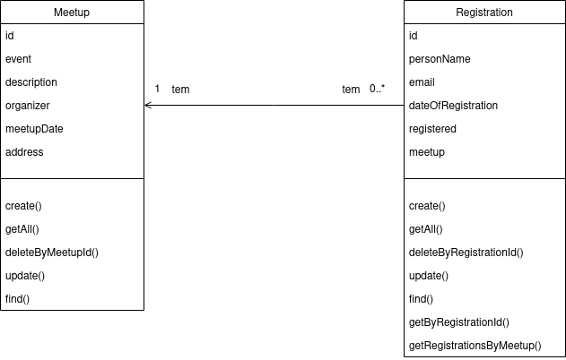
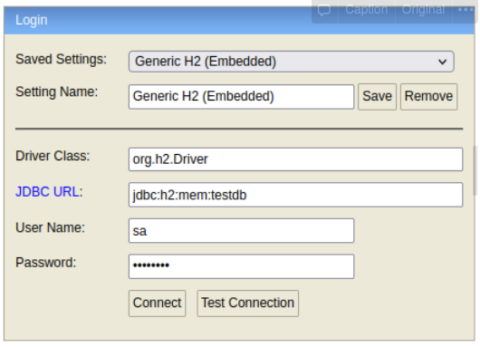

# Bootcamp Java Womakerscode 2022

## 🤔 O que é o projeto?

Consiste num pequeno microservice que tem lado de client e server no momento de se cadastrar num meetup.

Segue o diagrama UML do projeto.

[//]: # (https://user-images.githubusercontent.com/42419543/162650128-1f8ab89f-0235-40a4-ad57-e60741ebf2ec.mp4)

## 💻 Tecnologias utilizadas

- Java 11
- Gradle
- Spring
- JPA
- Swagger
- Log4j2
- TDD Test Driven Development
- Azure functions

## Deploy no Azure
No arquivo **build.gradle**, colocar o ID da subscrição no Azure subscription = ID_AZURE_SUBCRIPTION

Depois de ter colocado o ID da subscrição do AZURE, executar:

    gradle azureWebAppDeploy

[Tutorial para deploy de aplicação gradle no Azure](https://devblogs.microsoft.com/java/gradle-deploy-java-web-apps-to-azure-in-one-step/)

Para consultar a documentação de nossa aplicação gerada pelo swagger:

- Local: [http://localhost:8080/swagger-ui/#](http://localhost:8080/swagger-ui/#)
- Produção: [https://agendamentomeetup.azurewebsites.net/swagger-ui/#](https://agendamentomeetup.azurewebsites.net/swagger-ui/#)

## Testes locais

Os Testes foram feitos no Insomnia.

A coleção de dados usados para teste no insomnia foi exportado para o arquivo **Insomnia_2022-05-05.json**

## Banco de dados H2

Para visualizar os dados diretamente no banco de dados. Podemos usar o link:

- local: [http://localhost:8080/h2-console/](http://localhost:8080/h2-console/)

Painel do gerenciamento do H2:

## 👩‍💻 TODO list
- [X] Implementação da classe se servico
- [X] Testes no service
- [X] Implementação da classe de controlle da web
- [X] Testes de contrato no controller
- [X] Testes unitarios no repository
- [X] Implementação do repository
- [X] Swagger
- [X] Testes locais via Insomnia
- [X] Deploy no azure

## TODO ALUNAS - camada Meetup

- [X] Testes do repository
- [X] Testes do controller
- [X] Testes do service
